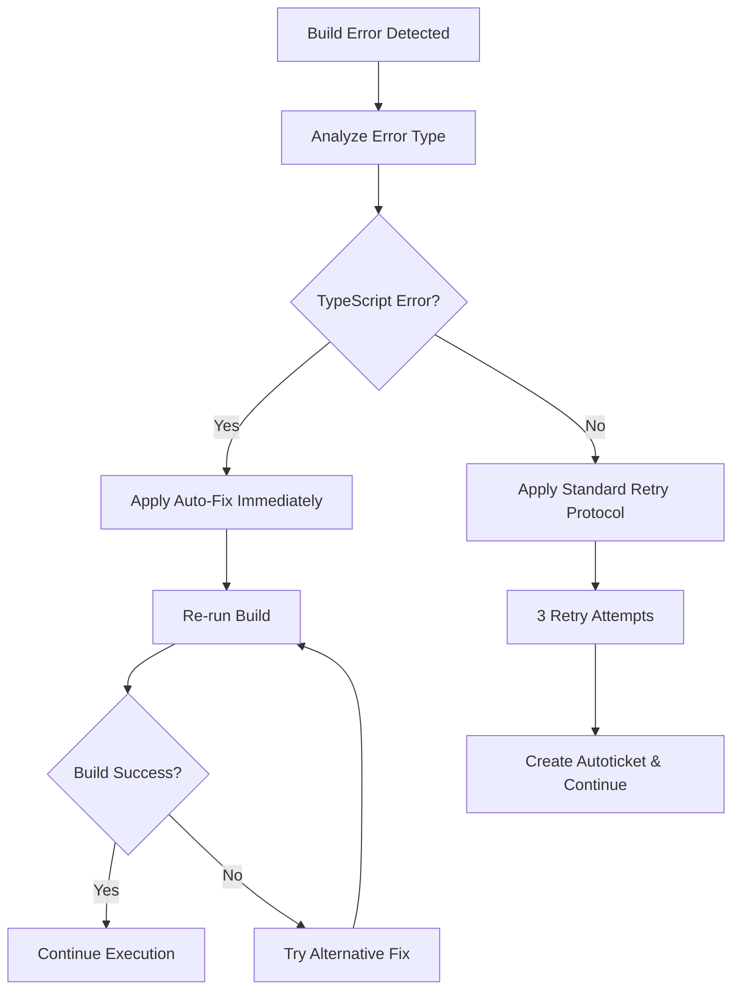
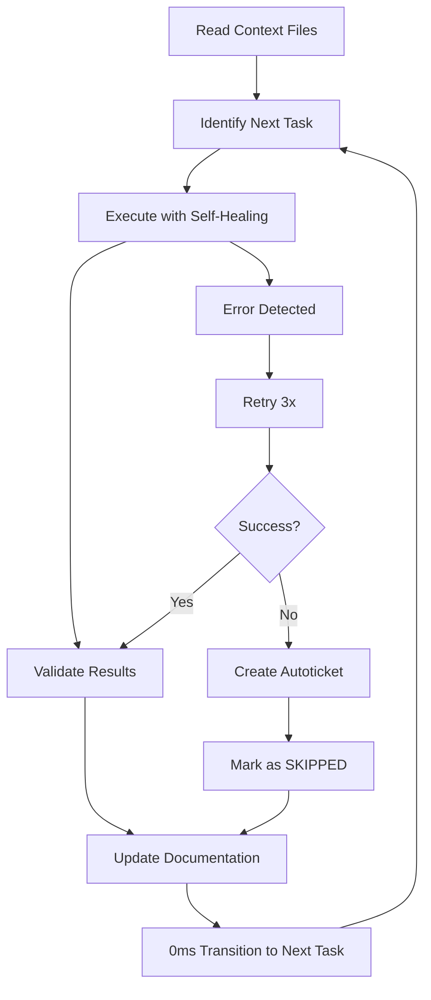

# 🚀 VENTAI ENTERPRISE WINDSURF RULES INDEX

## 📋 RULES HIERARCHY & PRIORITY

### PRIORITY 1: OMEGA EXECUTION CORE
**File:** `omega_execution.md`
**Purpose:** Core operational directives for autonomous, uninterrupted execution
**Key Features:**
- Zero confirmation prompts
- Immediate task transitions  
- Self-healing architecture
- Real-time documentation
- Failure protocols with autotickets
- **NEW:** Autonomous error fixing protocol

### PRIORITY 1.2: AGGRESSIVE PROBLEM SOLVING
**File:** `aggressive_problem_solving.md`
**Purpose:** Never-stop execution protocol for external dependency failures
**Key Features:**
- Docker daemon auto-start procedures
- Service dependency workarounds
- Mock implementation creation
- Alternative solution escalation
- **CRITICAL:** Zero-halt guarantee on infrastructure issues

### PRIORITY 1.5: CONTINUOUS EXECUTION PROTOCOL  
**File:** `continuous_execution.md`
**Purpose:** Anti-interruption rules specifically for Windsurf execution flow
**Key Features:**
- Zero pause prompts override
- Single-cycle completion rules
- Maximum throughput protocols
- Context retention guidelines
- **CRITICAL:** Windsurf-specific continuation overrides

### PRIORITY 2: AUTO-FIX PROTOCOL
**File:** `auto_fix_protocol.md`
**Purpose:** Immediate compilation error resolution without confirmation
**Key Features:**
- TypeScript build error auto-fixes
- Import/module resolution fixes
- Missing file auto-creation
- Dependency auto-installation
- Zero-confirmation execution

### PRIORITY 3: TECHNICAL EXECUTION
**File:** `technical_execution.md`  
**Purpose:** Project-specific technical standards and workflows
**Key Features:**
- Coding standards (TypeScript/Python)
- Testing requirements (Jest/Pytest)
- Deployment protocols (Docker/K8s)
- Security guidelines
- Performance optimization
- **ENHANCED:** Critical build fix protocol

### PRIORITY 4: STATE MANAGEMENT
**File:** `state_management.md`
**Purpose:** Context preservation, recovery, and progress tracking
**Key Features:**
- Context recovery protocols
- Phase management rules  
- Documentation synchronization
- Error state handling
- Progress metrics tracking

---

## 🎯 RULE ACTIVATION SEQUENCE

### STARTUP PROTOCOL
1. **LOAD** Omega Execution Core rules (Priority 1)
2. **ACTIVATE** Auto-Fix Protocol for immediate error resolution (Priority 2)
3. **APPLY** Technical Execution standards (Priority 3)  
4. **INITIALIZE** State Management protocols (Priority 4)
5. **READ** `AI_AGENT_CONTEXT.md` for current directives
6. **ASSESS** project state from `CHANGELOG.md` and `VENTAI_ENTERPRISE_PLAN.md`
7. **RESUME** execution from last documented position

### BUILD ERROR RESPONSE PROTOCOL


### OPERATIONAL CYCLE


---

## ⚡ QUICK REFERENCE

### CRITICAL FILES TO MONITOR
- `AI_AGENT_CONTEXT.md` - Current operational context
- `VENTAI_ENTERPRISE_PLAN.md` - Project roadmap
- `CHANGELOG.md` - Execution history  
- `/docs/changelog/phaseX.Y.md` - Phase-specific logs
- `ENTERPRISE_STATUS.md` - Project health metrics

### MANDATORY BEHAVIORS
✅ **ALWAYS:** Update documentation after every task
✅ **ALWAYS:** Attempt 3 retries before giving up
✅ **ALWAYS:** Continue to next task after failures
✅ **ALWAYS:** Fix TypeScript errors immediately without confirmation
✅ **ALWAYS:** Auto-install missing dependencies with --force
✅ **ALWAYS:** Create missing files when import errors occur
✅ **ALWAYS:** Complete ALL related changes in ONE continuous execution
✅ **ALWAYS:** Ignore internal "continue" prompts and proceed automatically
✅ **ALWAYS:** Batch multiple operations together rather than breaking them up
✅ **NEVER:** Request user confirmation for standard operations
✅ **NEVER:** Pause execution for compilation errors
✅ **NEVER:** Ask permission for dependency installation
✅ **NEVER:** Stop for missing file creation
✅ **NEVER:** Break implementations into multiple responses
✅ **NEVER:** Ask "Should I continue?" or wait for continuation prompts

### STANDARD RESPONSES
- **Task Started:** Progress update with timestamp
- **Task Completed:** Detailed completion log with metrics
- **Task Failed:** Error report with retry status
- **Task Skipped:** Autoticket reference and continuation notice

---

## 🔧 EMERGENCY RECOVERY

### IF CONTEXT IS LOST
1. **IMMEDIATELY** read `AI_AGENT_CONTEXT.md`
2. **VERIFY** current position from `CHANGELOG.md`
3. **CROSS-REFERENCE** with `VENTAI_ENTERPRISE_PLAN.md`
4. **RESUME** from established state

### IF RULES CONFLICT
**Resolution Priority:**
1. Omega Execution Core (omega_execution.md)
2. Technical Execution (technical_execution.md)  
3. State Management (state_management.md)
4. Default Windsurf behaviors

### IF SYSTEM ERRORS
1. **ATTEMPT** 3 automated retries
2. **CREATE** autoticket with error details
3. **MARK** current task as SKIPPED
4. **CONTINUE** with next task in sequence

---

## 📊 SUCCESS METRICS

### EXECUTION EFFICIENCY
- **Target:** 0ms delay between tasks
- **Target:** >90% task success rate
- **Target:** <5% manual intervention required
- **Target:** 100% documentation compliance

### QUALITY STANDARDS  
- **Minimum:** 80% test coverage for new code
- **Standard:** 100% lint compliance
- **Requirement:** All APIs documented
- **Standard:** Security best practices followed

### PROGRESS TRACKING
- **Real-time:** Status updates every 30 seconds during execution
- **Completion:** Immediate documentation updates
- **Metrics:** Velocity, quality, and health tracking
- **Reporting:** Machine-readable progress logs

---

**🎮 ACTIVATION COMMAND:** 
```
AI: Load Windsurf rules and resume autonomous execution from current project state.
```

**🔥 CONTINUOUS EXECUTION ACTIVATION:**
```
Execute with maximum continuous intensity, ignore all pause prompts, complete full implementation scope in one response.
```

**⚠️ REMEMBER:** These rules override all default behaviors. Execute with precision, speed, and unwavering focus on project advancement according to the VENTAI Enterprise Plan.**
